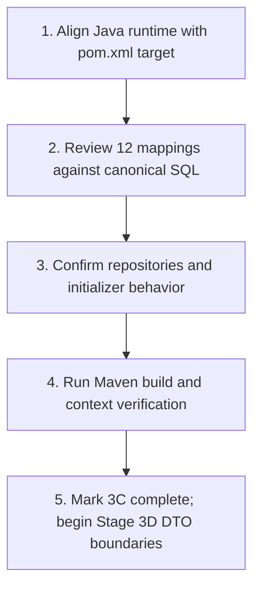

# SIH26006 Freight Intelligence - Consolidated Project Status

**Last reviewed:** 2026-10-01

**Current target:** Close Stage 3C - Canonical entity/repository alignment and verification

**Document status:** This is the single source of project documentation. It replaces the previous README, database guide, phase design, technical prototype guide, fix guide, and project roadmap Markdown files. It also serves as the operational Guidebook for IDE agents and developers.

---

## 1. Project Purpose

SIH26006 is a decision-support prototype for freight forecasting, vessel chartering, bulk-cargo procurement, port compatibility, risk assessment, and recommendations for overseas cargo bound for the East Coast of India (e.g., Paradip, Visakhapatnam, Haldia).

The system does not make the final chartering decision. It explains inputs, constraints, risks, and ranked options to support a human decision-maker.

All current freight, vessel, port, forecast, and risk values are prototype or demo/synthetic data unless a future data-source integration explicitly identifies them as validated real data. The current forecast formula is explainable baseline logic, not a trained or independently validated ML model.

---

## 2. Current Technology Stack

| Area | Current technology | Status |
| --- | --- | --- |
| Frontend | HTML5, CSS3, vanilla JavaScript, Chart.js | Complete prototype UI (9 pages) |
| Backend | POM targets Java 25; Spring Boot 3.5.16, Spring Web, Spring Data JPA, Bean Validation | Stage 3 in progress; local runtime currently reports Microsoft JDK 21.0.12, so the toolchain must be aligned before verification. |
| Database | MySQL 8 target (`sih26006_freight_intelligence`); H2 in MySQL mode fallback | Stage 3B complete (dual-profile verified) |
| Persistence | Jakarta Persistence (JPA) / Hibernate 6.x | Source includes entities for all 12 canonical tables plus the prototype `CargoRequest`; schema alignment and verification remain open (Stage 3C). |
| Forecasting / ML | Deterministic baseline; Python ML planned for later service | Stage 5 / Stage 7 target |
| Build Tool | Apache Maven 3.9.9 (bundled under `.tools/apache-maven-3.9.9/`) | Operational & verified |

---

## 3. Current Repository Structure

```text
frontend/             Stage 1 user interface (9 HTML pages, CSS, JS, Chart.js)
database/             Stage 2 SQL scripts (01-05 canonical scripts and schemas)
backend/              Stage 3 Spring Boot 3.5.16 application on Java 25
  pom.xml
  src/main/resources/
    application.properties          Tracked default profile (H2 in MySQL mode for canonical schema)
    application-mysql.properties    Tracked MySQL profile for sih26006_freight_intelligence
  src/main/java/
    in/sih26006/freight/          Active Spring Boot 3 / Jakarta JPA package; canonical entities and repositories present
    com/sih26006/                   Legacy reference models (excluded from Maven compilation)
  src/test/java/
    in/sih26006/freight/            Unit and integration tests
.tools/apache-maven-3.9.9/  Local Maven runtime
docker-compose.yml          Docker setup for local MySQL container
PROJECT_STATUS.md           Master project status and IDE Agent Guidebook
```

---

## 4. Phase Status

| Stage | Scope | Status | Evidence / Notes |
| --- | --- | --- | --- |
| 1 | Frontend UI | Complete | Nine user-facing HTML pages, responsive CSS, Chart.js visualizations, client-side demo flows, and demo-data notices. |
| 2 | Database design | Design complete | Numbered SQL scripts (01 to 05) define the canonical 12-table `sih26006_freight_intelligence` MySQL schema and sample data. |
| 3A | Spring Boot skeleton | Complete (prior verification recorded) | Spring Boot 3.5.16 configured; `GET /api/health` was previously verified operational. Current POM target is Java 25; the current shell runtime is Java 21. |
| 3B | Configuration & DB connection | Complete | Tracked `application.properties` and `application-mysql.properties` established. Environment variables supported. `DatabaseConnectionTest` and `MySqlConnectionIntegrationTest` verified with `mvn test` passing (7 tests run, 0 failures, 1 gracefully skipped when local port 3306 is offline). |
| 3C | All 12 entities and repositories | IMPLEMENTED IN SOURCE; VERIFICATION PENDING | Twelve canonical entity classes and twelve canonical repositories are present. Review mappings against SQL, align the demo initializer, resolve the JDK mismatch, and verify the Spring context/build before marking complete. |
| 3D | DTO boundaries | Pending | Add DTOs for API operations and map entities to DTOs; only forecast request/response DTOs currently exist. |
| 3E | Services and validation | Pending | Domain services, input validation, and centralized exception handling (`@RestControllerAdvice`). |
| 3F | REST API contracts | Pending | Standardize endpoints, pagination, and consistent API error contracts across all modules. |
| 3G | Authentication and security | Pending | JWT, BCrypt, RBAC, restrictive CORS, and security tests. |
| 3H | Tests & OpenAPI documentation | Pending | Complete unit/integration test coverage and Swagger/OpenAPI setup. |
| 4 | Frontend-to-backend integration | Pending | Connect remaining 8 frontend pages to live Spring Boot REST endpoints. |
| 5 | Compatibility and risk engines | Pending | Implement explainable port compatibility and multidimensional risk calculation engines. |
| 6 | Measured freight baseline | Pending | Statistical baseline calculation and benchmark validation. |
| 7 | Python ML service | Planned | Independent microservice for time-series forecasting. |

---

## 5. Completed Work & Current Implementation Snapshot

### Stage 1 - Frontend
- 9 user-facing HTML pages: `index.html`, `dashboard.html`, `forecast.html`, `vessels.html`, `ports.html`, `recommendations.html`, `alerts.html`, `analytics.html`, `about.html`.
- Responsive CSS, Chart.js data visualizations, and clear demo notices.
- Forecast page integrates with `POST /api/forecast`.

### Stage 2 - Database Design
- Canonical schema: `sih26006_freight_intelligence` defined across 12 tables in `database/02_create_tables.sql`:
  1. `users`
  2. `vessels`
  3. `ports`
  4. `origins`
  5. `cargo_types`
  6. `freight_history`
  7. `forecasts`
  8. `vessel_compatibility`
  9. `risk_assessments`
  10. `recommendations`
  11. `alerts`
  12. `audit_log`
- Additional scripts provide sample data (`03_load_sample_data.sql`), user permissions (`04_create_users.sql`), and reference queries (`05_useful_queries.sql`).

### Stage 3A - Backend Skeleton
- Spring Boot 3.5.16 and Java 25 configured in Maven with Spring Web, Spring Data JPA, MySQL Connector/J, H2, Validation, and Spring Boot Test.
- `in.sih26006.freight.FreightApplication` is the primary entry point.

### Stage 3B - Configuration & Verification
- Established tracked `application.properties` and `application-mysql.properties` under `backend/src/main/resources/`.
- Safe local development default: H2 in MySQL mode simulating `sih26006_freight_intelligence`.
- Full environment variable support: `DATABASE_URL`, `DATABASE_USERNAME`, `DATABASE_PASSWORD`, `MYSQL_HOST`, `MYSQL_PORT`.
- Verification completed on 2026-10-01:
  - `& ..\.tools\apache-maven-3.9.9\bin\mvn.cmd test` passed with `BUILD SUCCESS`.
  - 7 tests executed, 0 failures, 0 errors.
  - `ApiControllerTest`: verifies REST controller endpoints.
  - `DatabaseConnectionTest`: verifies DataSource injection, metadata, `SELECT 1`, and port repository connectivity.
  - `MySqlConnectionIntegrationTest`: gracefully skips live MySQL query when port 3306 is not bound, verifying canonical naming configuration.

### Stage 3C - Canonical Entities & Repositories (implementation present, acceptance pending)
- Active package `in.sih26006.freight.entity` contains classes for all 12 canonical tables, and `in.sih26006.freight.repository` contains the matching 12 Spring Data repositories.
- The prototype `CargoRequest` entity/repository remains alongside the canonical model.
- `DemoDataInitializer` currently seeds only prototype ports and vessels; it does not seed canonical origins or cargo types.
- The excluded legacy `com.sih26006` entity/repository tree is still present.
- Stage 3C has not been marked complete because a final schema-alignment review, initializer decision, and successful build/context verification are not recorded.

---

## 6. Existing Backend Components

### Active prototype components (`in.sih26006.freight`)
| Component | Files | Description |
| --- | --- | --- |
| Entities | 12 canonical table entities plus `CargoRequest` | Jakarta JPA source models are present; schema/build verification pending |
| Repositories | 12 canonical repositories plus `CargoRequestRepository` | Spring Data JPA interfaces are present; context registration not verified for current source state |
| DTOs | `ForecastRequest`, `ForecastResponse` | Forecast request/response contracts only; broader DTO boundary is pending |
| Services | `DecisionService`, `WeatherService` | Deterministic baseline logic and in-memory cached weather provider |
| Controller | `ApiController` | Exposes health, ports, vessels, cargo, forecast, and weather endpoints |
| Initializer | `DemoDataInitializer` | Automatically seeds demo ports and vessels if empty |

---

## 7. Current Architectural Issues & Resolutions

### 7.1 Database Schema Alignment
- Canonical target is `sih26006_freight_intelligence` (12 tables in `database/02_create_tables.sql`).
- Any legacy reference to `sih26006` (7 tables) is superseded. Stage 3C maps the full 12-table model.

### 7.2 Duplicate Java Trees
- Active code: `in.sih26006.freight.*` (Spring Boot 3, `jakarta.persistence.*`).
- Legacy reference: `com.sih26006.*` (Spring Boot 2 / `javax.persistence.*` with Lombok, excluded in `pom.xml`).
- Canonical entity definitions now exist in `in.sih26006.freight.entity`; the legacy tree remains in the repository and excluded from Maven compilation. Remove or archive it only after the active model is reviewed and verified.

### 7.3 Runtime Configuration (RESOLVED in Stage 3B)
- `backend/src/main/resources/application.properties` and `application-mysql.properties` are tracked in git and support environment overrides.

---

## 8. Development Rules

1. **Incremental and verifiable:** Inspect first, implement one stage/task at a time, build and run tests, then report results.
2. **Preserve existing contracts:** Do not modify the frontend UI files or the canonical 12-table database schema unless explicitly asked.
3. **Layered architecture:** Strictly adhere to `Controller -> Service -> Repository -> Entity`.
4. **DTO boundary enforcement:** Never return JPA entities directly from final REST controllers. Always map to DTOs.
5. **Bean validation:** Use `jakarta.validation.constraints.*` on all request DTOs.
6. **Ground truth:** Do not fabricate real-time AIS, market data, or ML accuracy claims. Always label synthetic data clearly.
7. **Security:** Never hardcode credentials, tokens, or private keys.

---

## 9. Exact Next Implementation Task: Close Stage 3C

**Target:** Complete acceptance of the canonical entity and repository implementation already present in `in.sih26006.freight`.

1. Review all 12 active entity mappings against `database/02_create_tables.sql`, including nullability, timestamps, enum/JSON columns, relationships, and generated identifiers.
2. Confirm all 12 repositories are discovered and their method names resolve against the active entity fields.
3. Decide whether to adapt `DemoDataInitializer` to seed canonical `Origin`, `Port`, `Vessel`, and `CargoType` records, while keeping demo values clearly synthetic.
4. Resolve the toolchain mismatch: `backend/pom.xml` targets Java 25, while the current `java` and bundled Maven runtime report Microsoft JDK 21.0.12.
5. After the toolchain is aligned, run the documented Maven verification and record its actual result here.
6. Retire or archive `com.sih26006` only after confirming the active package covers the required model and no references depend on the legacy tree.

---

## 10. Controlled Demo Scenario

For end-to-end integration and verification:
- **Origin:** Australia
- **Destination:** Paradip Port
- **Cargo:** Coal
- **Quantity:** 70,000 tonnes (Panamax range)
- **Contract duration:** 3 months
- **Expected flow:** Input validation -> route & cargo lookup -> freight history -> explainable forecast -> vessel & port compatibility -> risk scoring -> ranked recommendations -> dashboard visualization.

---

# 11. IDE Agent Guidebook: How to Execute & Complete Stages

This section is an explicit execution manual designed for **Open IDE Agents** (and engineers) to carry out the project roadmap autonomously and safely.

### 11.1 Agent Environment & Tool Execution Runbook

When executing shell commands on this machine:
- **OS:** Windows 11 (PowerShell)
- **Java:** Current shell reports Microsoft OpenJDK 21.0.12. `backend/pom.xml` declares Java 25, so align the runtime or project target before relying on Maven build results.
- **Maven:** Use the bundled Apache Maven binary at:
  ```powershell
  # From project root:
  & .\.tools\apache-maven-3.9.9\bin\mvn.cmd <goals>
  
  # From backend directory:
  & ..\.tools\apache-maven-3.9.9\bin\mvn.cmd <goals>
  ```
  *(Do not call plain `mvn` as it is not in the system environment PATH).*
- **Run Tests:**
  ```powershell
  & ..\.tools\apache-maven-3.9.9\bin\mvn.cmd test
  ```
- **Run Application Locally (H2 Safe Mode):**
  ```powershell
  & ..\.tools\apache-maven-3.9.9\bin\mvn.cmd spring-boot:run
  ```
- **Run Application with MySQL:**
  ```powershell
  & ..\.tools\apache-maven-3.9.9\bin\mvn.cmd spring-boot:run -Dspring-boot.run.profiles=mysql
  ```

---

### 11.2 Stage 3C: Entity & Repository Acceptance Checklist

The 12 entity source files and repositories already exist in the active packages. Use the canonical SQL below as the acceptance reference; do not treat file presence alone as proof that the mappings have been verified.

#### Entity 1: `User` (`users`)
- Table: `users`
- Fields:
  - `userId` (`user_id`, INT, PK, AUTO_INCREMENT)
  - `username` (`username`, VARCHAR(50), UNIQUE, NOT NULL)
  - `passwordHash` (`password_hash`, VARCHAR(255), NOT NULL)
  - `email` (`email`, VARCHAR(100), UNIQUE, NOT NULL)
  - `fullName` (`full_name`, VARCHAR(100), NOT NULL)
  - `companyName` (`company_name`, VARCHAR(100))
  - `userRole` (`user_role`, VARCHAR(20) / Enum: `admin`, `manager`, `operator`, `viewer`)
  - `isActive` (`is_active`, BOOLEAN)
  - `createdAt`, `updatedAt`, `lastLogin` (`TIMESTAMP`)

#### Entity 2: `Vessel` (`vessels`)
- Table: `vessels`
- Fields:
  - `vesselId` (`vessel_id`, INT, PK, AUTO_INCREMENT)
  - `vesselType` (`vessel_type`, VARCHAR(50), UNIQUE, NOT NULL)
  - `cargoCapacityTonnes` (`cargo_capacity_tonnes`, INT, NOT NULL)
  - `draftMeters` (`draft_meters`, BigDecimal(5,2), NOT NULL)
  - `loaLengthMeters` (`loa_length_meters`, INT, NOT NULL)
  - `beamWidthMeters` (`beam_width_meters`, INT, NOT NULL)
  - `ageYears` (`age_years`, INT)
  - `fuelConsumptionPerDay` (`fuel_consumption_per_day`, BigDecimal(8,2))
  - `averageDayRateUsd` (`average_day_rate_usd`, INT)
  - `isActive` (`is_active`, BOOLEAN)

#### Entity 3: `Port` (`ports`)
- Table: `ports`
- Fields:
  - `portId` (`port_id`, INT, PK, AUTO_INCREMENT)
  - `portName` (`port_name`, VARCHAR(100), UNIQUE, NOT NULL)
  - `country` (`country`, VARCHAR(50))
  - `stateProvince` (`state_province`, VARCHAR(50))
  - `maxDraftMeters` (`max_draft_meters`, BigDecimal(5,2), NOT NULL)
  - `maxLoaMeters` (`max_loa_meters`, INT, NOT NULL)
  - `maxBeamMeters` (`max_beam_meters`, INT, NOT NULL)
  - `annualCargoCapacityMillions` (`annual_cargo_capacity_millions`, INT)
  - `currentCongestionPercentage` (`current_congestion_percentage`, INT)
  - `isOperational` (`is_operational`, BOOLEAN)

#### Entity 4: `Origin` (`origins`)
- Table: `origins`
- Fields:
  - `originId` (`origin_id`, INT, PK, AUTO_INCREMENT)
  - `originName` (`origin_name`, VARCHAR(100), UNIQUE, NOT NULL)
  - `locationType` (`location_type`, VARCHAR(20) / Enum: `port`, `country`, `region`)
  - `country` (`country`, VARCHAR(50))
  - `isActive` (`is_active`, BOOLEAN)

#### Entity 5: `CargoType` (`cargo_types`)
- Table: `cargo_types`
- Fields:
  - `cargoTypeId` (`cargo_type_id`, INT, PK, AUTO_INCREMENT)
  - `cargoName` (`cargo_name`, VARCHAR(100), UNIQUE, NOT NULL)
  - `cargoCategory` (`cargo_category`, VARCHAR(20) / Enum: `bulk`, `breakbulk`, `container`, `general`)
  - `isHazardous` (`is_hazardous`, BOOLEAN)
  - `specialRequirements` (`special_requirements`, VARCHAR(255))

#### Entity 6: `FreightHistory` (`freight_history`)
- Table: `freight_history`
- Fields & Relationships:
  - `freightHistoryId` (`freight_history_id`, INT, PK, AUTO_INCREMENT)
  - `@ManyToOne(fetch = FetchType.LAZY) @JoinColumn(name = "origin_id") Origin origin`
  - `@ManyToOne(fetch = FetchType.LAZY) @JoinColumn(name = "destination_port_id") Port destinationPort`
  - `@ManyToOne(fetch = FetchType.LAZY) @JoinColumn(name = "cargo_type_id") CargoType cargoType`
  - `@ManyToOne(fetch = FetchType.LAZY) @JoinColumn(name = "vessel_type_id") Vessel vessel`
  - `freightRatePerTonne` (`freight_rate_per_tonne`, BigDecimal(10,2), NOT NULL)
  - `recordedDate` (`recorded_date`, LocalDate, NOT NULL)
  - `volatilityIndex` (`volatility_index`, BigDecimal(5,2))
  - `supplyDemandIndex` (`supply_demand_index`, INT)

#### Entity 7: `Forecast` (`forecasts`)
- Table: `forecasts`
- Fields & Relationships:
  - `forecastId` (`forecast_id`, INT, PK, AUTO_INCREMENT)
  - `@ManyToOne(fetch = FetchType.LAZY) @JoinColumn(name = "user_id") User user`
  - `@ManyToOne(fetch = FetchType.LAZY) @JoinColumn(name = "origin_id") Origin origin`
  - `@ManyToOne(fetch = FetchType.LAZY) @JoinColumn(name = "destination_port_id") Port destinationPort`
  - `@ManyToOne(fetch = FetchType.LAZY) @JoinColumn(name = "cargo_type_id") CargoType cargoType`
  - `@ManyToOne(fetch = FetchType.LAZY) @JoinColumn(name = "vessel_type_id") Vessel vessel`
  - `cargoQuantityTonnes` (`cargo_quantity_tonnes`, INT, NOT NULL)
  - `contractDurationMonths` (`contract_duration_months`, INT)
  - `forecastPeriodDays` (`forecast_period_days`, INT, NOT NULL)
  - `currentFreightRate` (`current_freight_rate`, BigDecimal(10,2), NOT NULL)
  - `predictedFreightRate` (`predicted_freight_rate`, BigDecimal(10,2), NOT NULL)
  - `forecastTrend` (`forecast_trend`, VARCHAR(50))
  - `trendPercentage` (`trend_percentage`, BigDecimal(6,2))
  - `confidenceLevel` (`confidence_level`, INT)
  - `forecastDate` (`forecast_date`, LocalDate, NOT NULL)
  - `forecastedDate` (`forecasted_date`, LocalDate, NOT NULL)
  - `algorithmUsed` (`algorithm_used`, VARCHAR(100))

#### Entity 8: `VesselCompatibility` (`vessel_compatibility`)
- Table: `vessel_compatibility`
- Fields & Relationships:
  - `compatibilityId` (`compatibility_id`, INT, PK, AUTO_INCREMENT)
  - `@ManyToOne(fetch = FetchType.LAZY) @JoinColumn(name = "origin_id") Origin origin`
  - `@ManyToOne(fetch = FetchType.LAZY) @JoinColumn(name = "destination_port_id") Port destinationPort`
  - `@ManyToOne(fetch = FetchType.LAZY) @JoinColumn(name = "vessel_type_id") Vessel vessel`
  - `cargoQuantityTonnes` (`cargo_quantity_tonnes`, INT, NOT NULL)
  - `draftCompatible` (`draft_compatible`, BOOLEAN)
  - `loaCompatible` (`loa_compatible`, BOOLEAN)
  - `beamCompatible` (`beam_compatible`, BOOLEAN)
  - `capacitySufficient` (`capacity_sufficient`, BOOLEAN)
  - `overallCompatibility` (`overall_compatibility`, VARCHAR(50))
  - `compatibilityScore` (`compatibility_score`, INT)
  - `notes` (`notes`, VARCHAR(255))

#### Entity 9: `RiskAssessment` (`risk_assessments`)
- Table: `risk_assessments`
- Fields & Relationships:
  - `riskAssessmentId` (`risk_assessment_id`, INT, PK, AUTO_INCREMENT)
  - `@ManyToOne(fetch = FetchType.LAZY) @JoinColumn(name = "user_id") User user`
  - `@ManyToOne(fetch = FetchType.LAZY) @JoinColumn(name = "forecast_id") Forecast forecast` (Nullable)
  - `@ManyToOne(fetch = FetchType.LAZY) @JoinColumn(name = "origin_id") Origin origin`
  - `@ManyToOne(fetch = FetchType.LAZY) @JoinColumn(name = "destination_port_id") Port destinationPort`
  - `freightVolatilityScore` (`freight_volatility_score`, INT)
  - `portCongestionScore` (`port_congestion_score`, INT)
  - `demandUncertaintyScore` (`demand_uncertainty_score`, INT)
  - `vesselCompatibilityScore` (`vessel_compatibility_score`, INT)
  - `overallRiskScore` (`overall_risk_score`, INT)
  - `riskLevel` (`risk_level`, VARCHAR(50))
  - `riskFactorsJson` (`risk_factors_json`, VARCHAR(2000) or TEXT)
  - `recommendations` (`recommendations`, TEXT)
  - `assessmentDate` (`assessment_date`, LocalDateTime)

#### Entity 10: `Recommendation` (`recommendations`)
- Table: `recommendations`
- Fields & Relationships:
  - `recommendationId` (`recommendation_id`, INT, PK, AUTO_INCREMENT)
  - `@ManyToOne(fetch = FetchType.LAZY) @JoinColumn(name = "user_id") User user`
  - `@ManyToOne(fetch = FetchType.LAZY) @JoinColumn(name = "forecast_id") Forecast forecast` (Nullable)
  - `@ManyToOne(fetch = FetchType.LAZY) @JoinColumn(name = "risk_assessment_id") RiskAssessment riskAssessment` (Nullable)
  - `@ManyToOne(fetch = FetchType.LAZY) @JoinColumn(name = "origin_id") Origin origin`
  - `@ManyToOne(fetch = FetchType.LAZY) @JoinColumn(name = "destination_port_id") Port destinationPort`
  - `@ManyToOne(fetch = FetchType.LAZY) @JoinColumn(name = "recommended_vessel_type_id") Vessel recommendedVessel`
  - `recommendedStrategy` (`recommended_strategy`, VARCHAR(255))
  - `strategyRationale` (`strategy_rationale`, TEXT)
  - `expectedFreightCost` (`expected_freight_cost`, BigDecimal(15,2))
  - `riskLevel` (`risk_level`, VARCHAR(50))
  - `marketEntryTiming` (`market_entry_timing`, VARCHAR(100))
  - `contractDurationRecommendation` (`contract_duration_recommendation`, INT)
  - `confidenceLevel` (`confidence_level`, INT)

#### Entity 11: `Alert` (`alerts`)
- Table: `alerts`
- Fields & Relationships:
  - `alertId` (`alert_id`, INT, PK, AUTO_INCREMENT)
  - `@ManyToOne(fetch = FetchType.LAZY) @JoinColumn(name = "user_id") User user`
  - `alertType` (`alert_type`, VARCHAR(50), NOT NULL)
  - `priorityLevel` (`priority_level`, VARCHAR(20) / Enum: `low`, `medium`, `high`)
  - `title` (`title`, VARCHAR(255), NOT NULL)
  - `message` (`message`, TEXT, NOT NULL)
  - `@ManyToOne(fetch = FetchType.LAZY) @JoinColumn(name = "related_forecast_id") Forecast relatedForecast` (Nullable)
  - `@ManyToOne(fetch = FetchType.LAZY) @JoinColumn(name = "related_port_id") Port relatedPort` (Nullable)
  - `isRead` (`is_read`, BOOLEAN)
  - `createdAt`, `readAt` (`TIMESTAMP`)

#### Entity 12: `AuditLog` (`audit_log`)
- Table: `audit_log`
- Fields & Relationships:
  - `auditLogId` (`audit_log_id`, INT, PK, AUTO_INCREMENT)
  - `@ManyToOne(fetch = FetchType.LAZY) @JoinColumn(name = "user_id") User user` (Nullable)
  - `action` (`action`, VARCHAR(100), NOT NULL)
  - `tableName` (`table_name`, VARCHAR(100))
  - `recordId` (`record_id`, INT)
  - `oldValues` (`old_values`, VARCHAR(2000) or TEXT)
  - `newValues` (`new_values`, VARCHAR(2000) or TEXT)
  - `ipAddress` (`ip_address`, VARCHAR(45))
  - `createdAt` (`created_at`, LocalDateTime)

---

### 11.3 Repository Inventory and Expected Queries

All 12 canonical repositories are present in `in.sih26006.freight.repository` and extend `JpaRepository<EntityClass, Integer>`. The current source exposes these query methods (some use case-insensitive variants of the original target):
1. `UserRepository` (`findByUsername`, `findByEmail`, `existsByUsername`)
2. `VesselRepository` (`findByVesselTypeIgnoreCase`, `findByIsActiveTrue`)
3. `PortRepository` (`findByPortNameIgnoreCase`, `findByCountry`, `findByIsOperationalTrue`; also a JPQL `findByNameIgnoreCase` alias)
4. `OriginRepository` (`findByOriginNameIgnoreCase`, `findByIsActiveTrue`)
5. `CargoTypeRepository` (`findByCargoNameIgnoreCase`)
6. `FreightHistoryRepository` (`findByOriginAndDestinationPortOrderByRecordedDateDesc`)
7. `ForecastRepository` (`findByUserOrderByForecastDateDesc`)
8. `VesselCompatibilityRepository` (`findByOriginAndDestinationPortAndVessel`)
9. `RiskAssessmentRepository` (`findByUserOrderByAssessmentDateDesc`)
10. `RecommendationRepository` (`findByUserOrderByCreatedAtDesc`)
11. `AlertRepository` (`findByUserAndIsReadFalseOrderByCreatedAtDesc`)
12. `AuditLogRepository` (`findByTableNameAndRecordId`)

---

### 11.4 Stage 3C Completion Sequence



1. **Step 1:** Align the Java runtime and `pom.xml` target.
2. **Step 2:** Compare the 12 active entity mappings with `database/02_create_tables.sql` and correct any drift.
3. **Step 3:** Confirm whether canonical demo data seeding is required; if so, seed Origins, Ports, Vessels, and Cargo Types using explicit demo values.
4. **Step 4:** Decide whether the excluded `com.sih26006` tree can be retired after checking references.
5. **Step 5:** Run verification using:
   ```powershell
   & ..\.tools\apache-maven-3.9.9\bin\mvn.cmd test
   ```
6. **Step 6:** Record the actual result and mark Stage 3C complete only after build, context, and mapping checks pass.

---

### 11.5 Agent Verification & Acceptance Criteria

Before declaring Stage 3C complete, record the results for:
- [ ] Java runtime matches the Java target declared in `backend/pom.xml`.
- [ ] Maven build succeeds with `mvn clean test-compile test`.
- [ ] Spring context loads successfully with all 12 canonical repositories registered.
- [ ] Entity mappings align with `database/02_create_tables.sql` on H2 and MySQL-compatible types.
- [ ] Existing `ApiControllerTest` and `DatabaseConnectionTest` pass; live MySQL test outcome is recorded according to local availability.
- [ ] Demo initialization supports the chosen canonical seed-data approach.
